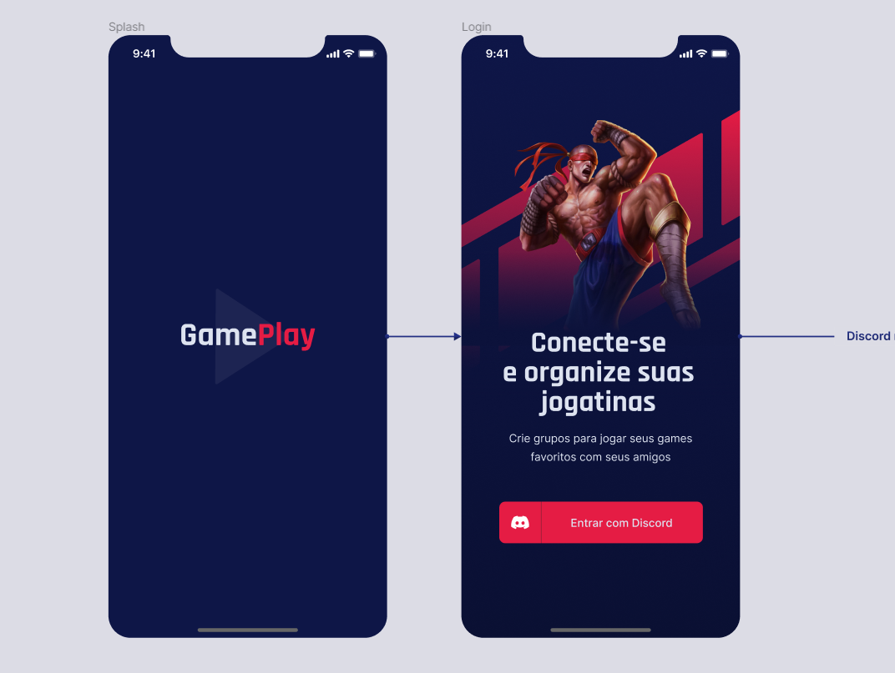

<h1 align="center">
  
</h1>
<blockquote align="center">“Sucesso não é o resultado de um jogo, mas o destino de uma jornada”!</blockquote>
<br>

<p align="center">
  
</p>

## 💻 Projeto
Aplicativo para lhe ajudar a conectar-se e organiza o momento de diversão e jogar com os amigos. Crie grupos para jogar seus games favoritos com seus amigos com esse App que possui autenticação com Discord.

## :hammer_and_wrench: Features

-   [ ] Autenticação Social OAuth2 com servidor do Discord.
-   [ ] Obtém perfil do usuário cadastro no Discord (username e avatar);
-   [ ] Lista os servidores do Discord que o usuário faz parte;
-   [ ] Permite realizar o agendamento de partidas;
-   [ ] Permite filtrar as partidas por categoria;
-   [ ] Exibe se a partida foi agendada em um servidor próprio (anfitrião) ou em servidores de outros (convidado);
-   [ ] Compartilha o convite para ingressar no servidor do usuário;
-   [ ] Permite redirecionar o usuário para o seu próprio servidor;
-   [ ] Disponibiliza a função de Logout.


## ✨ Tecnologias

-   [ ] React Native
-   [ ] Typescript
-   [ ] Expo
-   [ ] Context API
-   [ ] Async Storage
-   [ ] Vector Icons
-   [ ] React Native Svg e Svg Transform
-   [ ] Axios
-   [ ] Gradient colors
-   [ ] OAuth2 Discord
-   [ ] Expo Google Fonts
-   [ ] React Navigation Stack
-   [ ] React Native Gesture Handler
-   [ ] Expo Authentication
-   [ ] React Native Share
-   [ ] Deep Link

## 🔖 Layout

Você pode visualizar o layout do projeto através [desse link](https://www.figma.com/file/0kv33XYjvOgvKGKHBaiR07/GamePlay-NLW-Together?node-id=58913%3A83). É necessário ter conta no [Figma](http://figma.com/) para acessá-lo.


## 🚀 Executando o projeto

Utilize o **yarn** ou o **npm install** para instalar as dependências do projeto.
Em seguida, inicie o projeto.

```cl
expo start
```

Lembre-se de criar o seu App no servidor do Discord para obter as credencias de autenticação. Em seguida, defina no arquivo .env as configurações do seu App (remova o example do arquivo .env.example).

 ```cl
REDIRECT_URI=
SCOPE=
RESPONSE_TYPE=
CLIENT_ID=
CDN_IMAGE=
```

## 📄 Licença

Esse projeto está sob a licença MIT. Veja o arquivo [LICENSE](LICENSE.md) para mais detalhes.

---

Projeto concluido com ♥ by PitzTech durante a NLW Together :wave:

<p align="center">
  <a href="https://www.linkedin.com/in/victor-laurentino-do-nascimento/"></a>
  &nbsp;&nbsp;&nbsp;&nbsp;
  <a href="mailto:victorlaurentino7@gmail.com?subject=Oi%20Victor!%20Vim%20do%20seu%20GitHub"></a>
  &nbsp;&nbsp;&nbsp;&nbsp;
  <a href="https://www.linkedin.com/in/victor-laurentino-do-nascimento/"></a>
</p>

<sup>Apoio da [Rocketseat](https://discord.com/invite/gCRAFhc)</sup>
