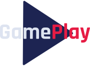

<h1 align="center">
  
</h1>
<blockquote align="center">“Sucesso não é o resultado de um jogo, mas o destino de uma jornada”!</blockquote>
 

  

## ✨ Tecnologias

Esse projeto foi desenvolvido com as seguintes tecnologias:

-  [React Native](https://reactnative.dev/)
-  [Typescript](https://www.typescriptlang.org/)
-  [Expo](https://expo.io/)

## 💻 Projeto

Aplicativo para lhe ajudar a crie grupos para jogar seus games favoritos com seus amigos.

## 🔖 Layout

Você pode visualizar o layout do projeto através [desse link](https://www.figma.com/file/IhQRtrOZdu3TrvkPYREzOy/PlantManager/duplicate). É necessário ter conta no [Figma](http://figma.com/) para acessá-lo.

## 🚀 Como executar

-  Clone o repositório
-  Instale as dependências com `yarn`
-  Inicie seu app com `expo start`
-  Inicie a fake api com `npx json-server --watch ./src/services/server.json -p 3333 --delay 700`. Substitua o host pelo seu endereço IP local. Faça o mesmo no arquivo API dentro de services.
- Inicie a ponte o servidor `npx ngrok http 3333` e coloque o endereço criado na propriedade `baseUrl` do arquivo [/src/services/api.ts](/src/services/api.ts)

## 📄 Licença

Esse projeto está sob a licença MIT. Veja o arquivo [LICENSE](LICENSE.md) para mais detalhes.

---

Projeto concluido com ♥ by PitzTech durante a NLW Together :wave:

  
  &nbsp;&nbsp;&nbsp;&nbsp;
  
  &nbsp;&nbsp;&nbsp;&nbsp;
  

Apoio da [Rocketseat](https://discord.com/invite/gCRAFhc)
